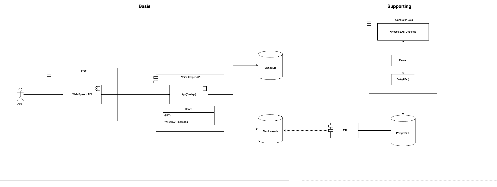

Ссылка на репозиторий: https://github.com/montekrist0/graduate_work

# graduate_work

## Авторы проекта

1. Artur Kukobin (@arkuk)
3. Bogdanov Igor (@montekrist0) - TL

## 1 Назначение модуля:

Данный модуль является частью проекта "Онлайн-кинотеатр", в котором представлен голосовой ассистент

---

## Архитектура

## 2 Используемые технологии сервиса

Технологический стек проекта:

1. [Nginx](https://www.nginx.com/) — веб-сервер;
2. Web Speech API - позволяет включать голосовые данные в веб-приложения;
3. WebSocket — протокол связи поверх TCP-соединения;
2. MongoDB - документоориентированная БД;
3. FastAPI — веб-фреймворки для создания веб-приложений;
4. Elasticsearch — NoSQL БД для полнотекстового поиска;
5. Kibana - веб-интерфейс для взаимодействия с Elasticsearch;
6. Redis — key-value БД;
7. ETL-скрипт, реализованный на языке Python;

Каждый модуль (сервис) запускается с помощью [Docker](https://www.docker.com/) контейнеров, тем самым реализуя в проекте
микросервисную архитектуру. Сервисы связаны между собой с помощью `docker compose`.

---

## 3 Запуск проекта

В проекте предусмотрен Makefile для удобства запуска проекта.

Для запуска проекта достаточно:
1. Убедиться, что в корне репозитория имеется файл `.env` с введенными параметрами по примеру `.env.example`;
2. Выполнить команду `make up`, находясь в корне репозитория

___
## 4 Описание API

GET `http://localhost:80/` - страница для взаимодействия с голосовым помощником
WS `http://localhost:80/api/v1/message` - WS соединение;
---
